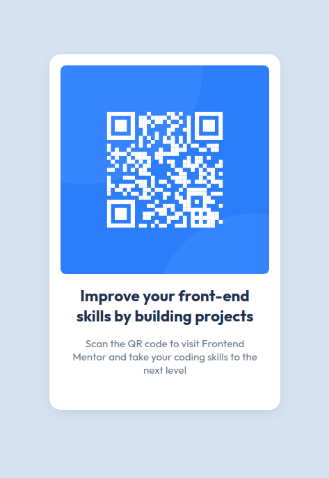

# Frontend Mentor - QR code component solution

This is a solution to the [QR code component challenge on Frontend Mentor](https://www.frontendmentor.io/challenges/qr-code-component-iux_sIO_H). Frontend Mentor challenges help you improve your coding skills by building realistic projects.

## Table of contents

- [Overview](#overview)
  - [Screenshot](#screenshot)
  - [Links](#links)
- [Why?](#why)
- [Author](#author)
- [Acknowledgments](#acknowledgments)

## Overview

### Screenshot

### Links

- Solution URL: [https://github.com/chochimus/qr-code-frontendMentor](https://github.com/chochimus/qr-code-frontendMentor)
- Live Site URL: [https://chochimus.github.io/qr-code-frontendMentor/](https://chochimus.github.io/qr-code-frontendMentor/)

### Why?

Just reinforcing some html, css basics. Mainly for fun.

## Author

- Frontend Mentor - [@chochimus](https://www.frontendmentor.io/profile/chochimus)
